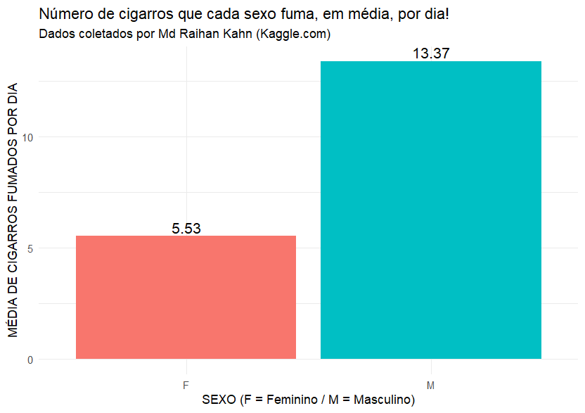
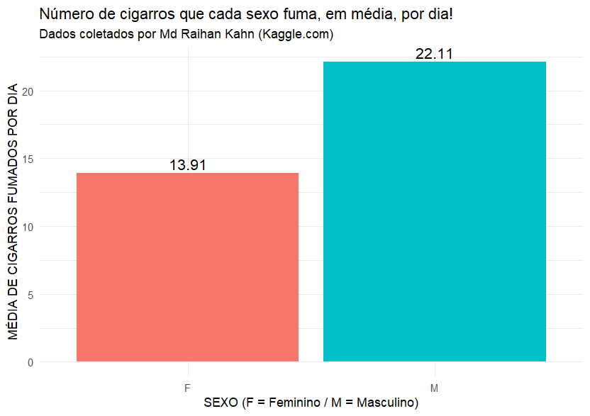

# Análise do Tabagismo por Sexo em Dados de Saúde

Projeto de análise exploratória utilizando **R** e **Tidyverse** para investigar diferenças no consumo de cigarros entre homens e mulheres a partir de um conjunto de dados de saúde pública.

---

## 🎯 Objetivo

Avaliar se existe diferença no **número médio de cigarros fumados por dia** entre os sexos, considerando duas perspectivas:

- **População geral** (incluindo não fumantes)
- **Apenas fumantes ativos**

Essa abordagem permite interpretar os resultados tanto no contexto de **saúde pública** quanto **clínico-epidemiológico**.

---

## 📕 Fonte dos Dados

- Base de dados pública obtida no **Kaggle**
- Aproximadamente **3.900 indivíduos**
- Variáveis disponíveis:
  - Sexo
  - Idade
  - Colesterol
  - Frequência cardíaca
  - Pressão arterial
  - Número de cigarros fumados por dia

---

## ⚙️ Metodologia

A análise foi conduzida em **R**, seguindo etapas clássicas de ciência de dados em saúde:

### 1. Limpeza e preparação dos dados
- Padronização da variável de sexo
- Remoção de valores ausentes relevantes
- Separação da pressão arterial em:
  - Pressão sistólica
  - Pressão diastólica
- Conversão de variáveis para formato numérico

### 2. Definição de grupos de análise
- **População total**
- **Subgrupo de fumantes ativos**

### 3. Estatística descritiva
Cálculo de:
- Número de indivíduos por sexo  
- Média de colesterol  
- Média de frequência cardíaca  
- Média de cigarros fumados por dia  

### 4. Visualização de dados
- Gráfico de barras com **ggplot2**
- Destaque para a média de cigarros por sexo
- Interpretação voltada à **saúde pública**

---

## 📊 Principais Resultados e o "Viés da População"

A análise revelou uma diferença crucial no entendimento do vício dependendo do filtro aplicado. Quando incluímos pacientes que não fumam (0 cigarros/dia), a gravidade do tabagismo é mascarada. 

Ao isolar apenas os fumantes ativos, a realidade clínica se mostra muito mais severa:

**1. Visão Populacional (Incluindo Não-Fumantes - Média Diluída)**
- **Homens:** 13.37 cigarros/dia
- **Mulheres:** 5.53 cigarros/dia

**2. Visão Fumantes Ativos (A Realidade do Vício)**
- **Homens:** 22.11 cigarros/dia
- **Mulheres:** 13.91 cigarros/dia

**Conclusão Epidemiológica:**
A análise não só confirma que os homens têm um consumo médio diário significativamente maior nesta amostra, mas também alerta para o perigo das **médias diluídas** na saúde pública. Ao isolar o grupo de risco, fica evidente que o consumo real do dependente é quase o **dobro** do que a média geral sugeria.

---

## 🧠 Aprendizados do Projeto

Este projeto demonstra competências iniciais em:

- **Limpeza e manipulação de dados em R**
- **Uso do Tidyverse para análise em saúde**
- **Visualização de dados com ggplot2**
- **Raciocínio epidemiológico aplicado**
- **Comunicação de resultados analíticos**

---

## 🛠️ Tecnologias Utilizadas

- **R**
- **Tidyverse** (dplyr, tidyr)
- **ggplot2**
- **RStudio**

---

## 👤 Autor

**Inácio Vieira** Graduando em Enfermagem — UFMG  
Foco em **Análise de Dados em Saúde** - LinkedIn: [inaciosantosvieira](https://www.linkedin.com/in/inaciosantosvieira/)  
- GitHub: [inaciovieiraa](https://github.com/inaciovieiraa)
