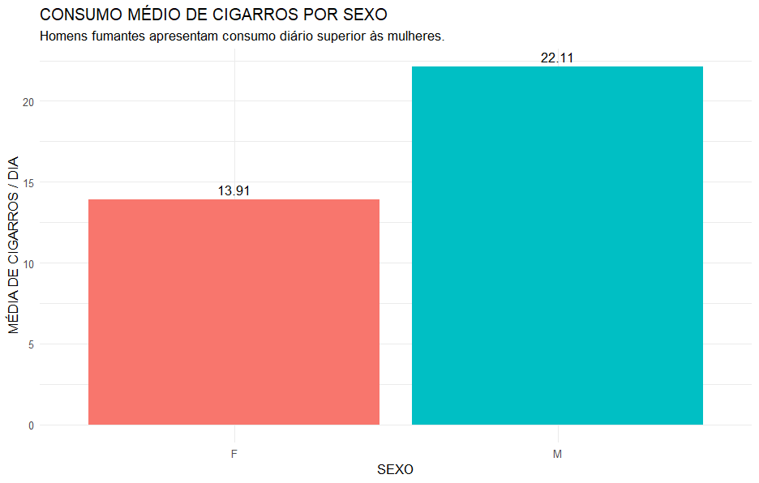
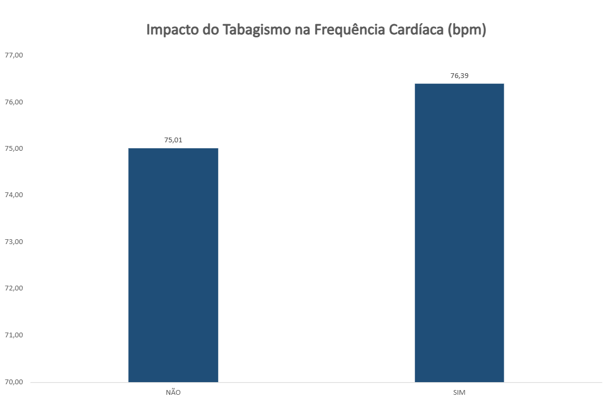
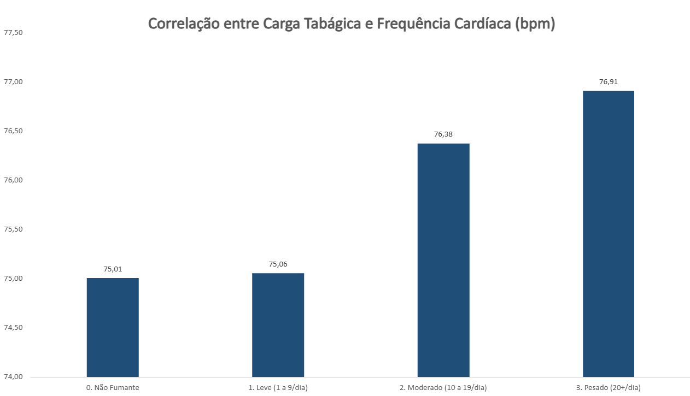
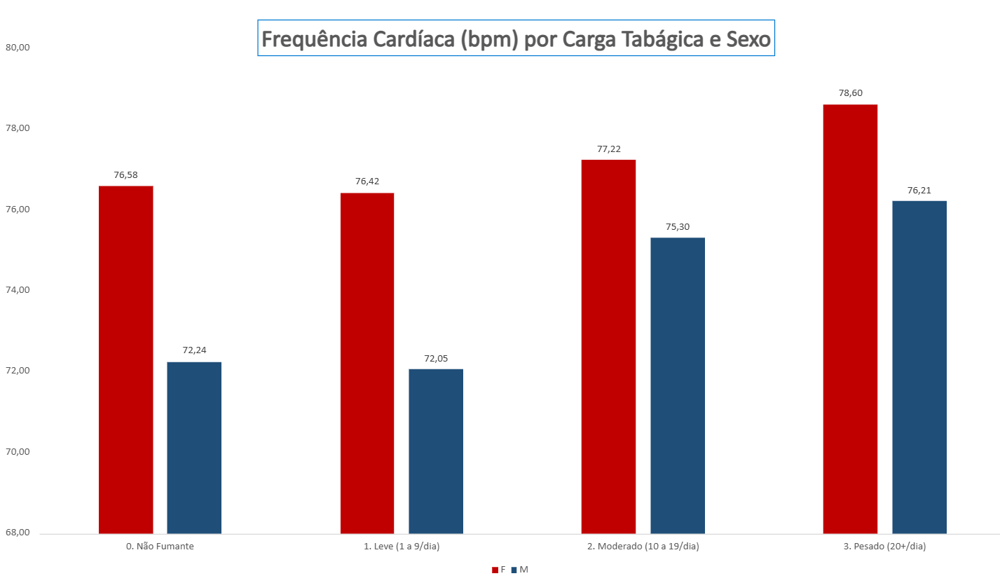

# Impacto Cardiovascular do Tabagismo: Análise Epidemiológica por Carga e Sexo


Estudo de caso em Análise de Dados de Saúde utilizando **R (Tidyverse)** para higienização e tratamento estatístico e **Microsoft Excel** para modelagem analítica e visualização interativa.

---

## 📖 Contexto:

Este projeto surgiu a partir de uma análise exploratória desenvolvida durante meus estudos em programação estatística com R. 

Inicialmente, o objetivo era apenas comparar o número médio de cigarros consumidos por homens e mulheres. Entretanto, durante a exploração da base de dados, percebi que ela continha informações capazes de responder perguntas muito mais interessantes do ponto de vista epidemiológico e clínico.

Por esse motivo, decidi reconstruir a análise utilizando uma abordagem mais completa e estruturada: combinei o poder da linguagem **R** para o tratamento pesado e preparação dos dados (*Data Wrangling*) com a flexibilidade do **Microsoft Excel** para exploração analítica visual e construção de dashboards.

O resultado foi um estudo que investiga como diferentes níveis de exposição ao tabagismo podem estar relacionados a alterações da frequência cardíaca basal e como esse comportamento fisiológico varia entre homens e mulheres.

---

## 📌 Objetivos:

Avaliar o impacto do tabagismo sobre indicadores cardiovasculares utilizando técnicas de análise exploratória de dados (EDA). O estudo procura responder três perguntas principais:

1. Existe uma relação direta entre a carga tabágica e a aceleração da frequência cardíaca?
2. Homens e mulheres apresentam padrões diferentes de consumo e resposta cardiovascular ao vício?
3. Como a interpretação epidemiológica muda quando analisamos apenas fumantes ativos em vez da população geral?

---

## 🧱 Estrutura do Repositório:

* [**`/data`**](./data): Base de dados original em `.csv` extraída do Kaggle e base limpa exportada pelo pipeline.
* [**`/scripts`**](./scripts): Código completo em `R` contendo o tratamento estatístico, *Complete-Case Analysis* e geração de gráficos estatísticos.
* [**`/plots`**](./plots): Gráficos e painéis visuais exportados em alta resolução, utilizados para a argumentação epidemiológica deste relatório.

---

## 🛠️ Tech Stack e Ferramentas:

Este projeto utiliza programação estatística orientada a dados para extrair insights e modelar o risco clínico:
* **Fonte dos Dados:** Base clínica de saúde pública (Kaggle).
* **Linguagem Principal:** `R`
* **Limpeza e Manipulação de Dados:** `dplyr` / `tidyr` / `stringr` (Ecossistema `tidyverse` para higienização de strings, fatoração de categorias clínicas e remoção cirúrgica de valores ausentes).
* **Visualização Estatística:** `ggplot2` (Geração de gráfico comparativo de consumo por sexo com exportação automatizada via `ggsave`).
* **Análise Exploratória e BI:** `Microsoft Excel` (Uso de Tabelas Dinâmicas, segmentação de dados e modelagem de painéis comparativos para avaliação de efeito dose-resposta).

---

## 📊 Base de Dados:

* **Fonte:** Base pública disponibilizada no [Kaggle — Smokers Health Data](https://www.kaggle.com/datasets/jaceprater/smokers-health-data/data)
* **Volume:** Aproximadamente **3.900 registros** de pacientes
* **Variáveis analisadas:**
  * Sexo e Idade
  * Frequência cardíaca basal (bpm)
  * Pressão arterial (sistólica e diastólica)
  * Nível de Colesterol total
  * Consumo diário de cigarros

---

## ⚙️ Pipeline de Dados:

A análise foi estruturada em duas etapas complementares, separando o processamento da visualização:

### 1. Limpeza e Tratamento em R:
Foi desenvolvido um script rigoroso para preparação dos dados utilizando o ecossistema `tidyverse` no arquivo `analise_tabagismo.R`. 

**Principais etapas:**
* Importação e higienização da base de dados bruta.
* **Tratamento de valores ausentes (*Complete-Case Analysis*):** Remoção de fumantes ativos que não informaram a quantidade consumida (`NA`), garantindo a pureza do grupo controle e evitando distorções nas médias.
* Padronização de strings e conversão de tipos numéricos.
* **Engenharia de Variáveis (*Feature Engineering*):**
  * Separação da coluna de pressão arterial em variáveis contínuas independentes (`SISTÓLICO` e `DIASTÓLICO`).
  * Criação da variável clínica `CARGA_TABAGICA`, estratificando os pacientes em: *Não fumantes (0)*, *Fumantes leves (1 a 9/dia)*, *Fumantes moderados (10 a 19/dia)* e *Fumantes pesados (20+/dia)*.
  * Criação de faixas etárias para controle epidemiológico.
* Exportação automática da base limpa (`dados_fumo_tratados_excel.csv`).

### 2. Exploração Analítica no Excel:
Após o tratamento estatístico na linguagem R, os dados foram conectados ao Microsoft Excel para construir análises exploratórias interativas. Foram empregadas:
* Tabelas Dinâmicas e Segmentações de Dados (*Slicers*)
* Gráficos Dinâmicos com foco em storytelling clínico
* Fórmulas de agregação e comparação de médias

---

## 🏆 Principais Resultados:

### 1. Perfil de Consumo dos Fumantes (A Realidade do Vício):
Ao analisar exclusivamente fumantes ativos — isolando o viés populacional de quem não fuma —, observou-se uma severidade de consumo significativamente maior:
* **Homens:** Média de **22,11 cigarros/dia** (Perfil pesado)
* **Mulheres:** Média de **13,91 cigarros/dia** (Perfil moderado)

> **Insight:** A média populacional dilui drasticamente o risco. Ao isolar o grupo de dependentes, fica evidente que o consumo real diário do homem fumante supera o marco clínico de 1 maço/dia (20+ cigarros).



---

### 2. Impacto Geral na Frequência Cardíaca:
A primeira validação clínica do estudo confirmou que a presença do tabagismo ativo está diretamente associada a uma elevação da frequência cardíaca basal da amostra.



---

### 3. Carga Tabágica e Frequência Cardíaca (Efeito Dose-Resposta):
A estratificação dos indivíduos por intensidade de consumo revelou um aumento progressivo da frequência cardíaca média conforme cresce a exposição ao tabaco, demonstrando um salto clínico importante a partir do consumo moderado. 

*(Embora esta seja uma análise descritiva, os resultados confirmam o efeito estimulante da nicotina e a relação de dose-resposta sobre o sistema miocárdico).*



---

### 4. Diferenças entre Homens e Mulheres (Fisiologia vs. Reatividade):
A análise estratificada cruzando sexo, carga tabágica e batimentos cardíacos mostrou comportamentos fisiológicos distintos:
* **Linha de Base Anatômica:** Mulheres apresentaram frequência cardíaca média superior em todas as categorias (padrão fisiológico coerente com o menor volume sistólico basal do coração feminino).
* **Reatividade Masculina:** Homens exibiram um aumento absoluto quase **duas vezes maior** na frequência cardíaca entre o estado basal e o grupo de tabagismo pesado (+3,97 bpm nos homens contra +2,02 bpm nas mulheres).
* **Viés de Confusão no Grupo Leve:** Foi observado que fumantes leves apresentaram médias ligeiramente inferiores às dos não fumantes. Epidemiologicamente, isso indica a presença de fatores de confusão na amostra (como idade mais avançada ou sedentarismo concentrados no grupo "Não Fumante"), o que abre uma excelente oportunidade para investigações em análises multivariadas futuras.



---

## ▶️ Como Executar a Análise (Portabilidade Total):

Este projeto foi desenvolvido de forma totalmente automatizada e estruturada. Para garantir que os caminhos relativos funcionem na sua máquina sem a necessidade de alterar linhas de código, siga o padrão de execução de projetos orientados a dados em R:

### 1. Baixe o Projeto Completo:
Para manter a estrutura de pastas e a integridade do pipeline intactas, faça o download do repositório:
* Clique no botão verde **Code** no topo desta página e selecione **Download ZIP** (ou clone via terminal utilizando o comando `git clone`).
* Descompacte a pasta no diretório de sua preferência.

### 2. Abra o Projeto via RStudio:
* Abra o **RStudio**. No menu superior, navegue em: `File > New Project > Existing Directory`.
* Clique em **Browse**, selecione a pasta raiz descompactada do projeto e confirme em **Create Project**.
* *Esta etapa define automaticamente o diretório de trabalho raiz, permitindo que os scripts leiam as pastas `/data` e `/plots` sem erros de caminho no sistema operacional.*

### 3. Instale as Dependências Necessárias:
Caso ainda não possua o ecossistema de ciência de dados instalado, execute o comando abaixo uma única vez no console do seu RStudio:
```r
install.packages("tidyverse")
```
### 4. Execute o Pipeline de Forma Automatizada:
* No painel de arquivos (*Files*) do RStudio, navegue até a pasta `/scripts` e abra o arquivo `analise_tabagismo.R`.
* Certifique-se de que a base bruta (`smoking_health_data_final.csv`) esteja alocada corretamente dentro da pasta `/data`.
* Pressione `Ctrl + A` (ou `Cmd + A` no Mac) para selecionar todo o script e clique no botão **Run** no canto superior da janela de código.

O pipeline executará o processamento estatístico de forma 100% autônoma, realizando:
1. **ETL Completo:** Leitura, higienização de strings e padronização das variáveis na base bruta;
2. **Complete-Case Analysis:** Remoção cirúrgica de valores ausentes (`NA`) para preservação das médias;
3. **Engenharia de Dados:** Exportação automática da base tratada (`dados_fumo_tratados_excel.csv`) diretamente para a pasta `/data`;
4. **Visualização:** Geração e salvamento automatizado do gráfico de consumo por sexo (`consumo_sexo.png`) na pasta `/plots` com resolução de 300 DPI.

### 5. Exploração Interativa no Microsoft Excel:
Na pasta `/data`, além do arquivo bruto necessário para rodar o script no R, você também encontrará a base tratada já pronta para uso (`dados_fumo_tratados_excel.csv`).

Caso queira focar apenas na modelagem de negócios sem precisar executar a programação em R, basta abrir essa base tratada diretamente no **Microsoft Excel** para interagir com as Tabelas Dinâmicas, segmentadores de dados (*Slicers*) e explorar os painéis visualmente.

---

**Por Inácio Vieira** *Estudante de Enfermagem na Universidade Federal de Minas Gerais (UFMG) | Iniciando em Análise de Dados em Saúde* [LinkedIn](https://www.linkedin.com/in/inaciosantosvieira/)

